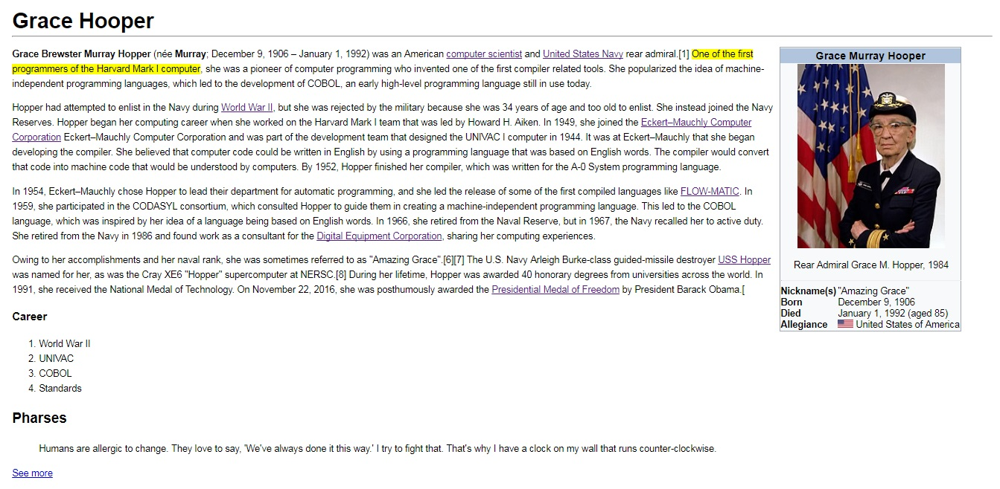

# Replicando la página de Grace Hopper de wikipedia #

## Introducción
El presente trabajo consiste en construir una réplica de la página de Grace Hopper de wikipedia, utilizando una estructura semántica y todas las bondades de CSS para representar el diseño lo más fiel posible.

## Vista final
